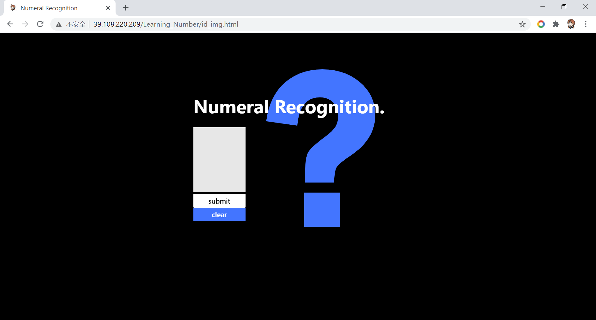

本人数据可视化课程的第一个小作业（别问为什么数据可视化的作业是这个），主要功能是前端提供一个页面可以手写数字，然后传到后端进行手写数字识别。

整体比较简单，没用什么框架。写路径没写明白，所以里面都用了绝对路径，如果有hxd愿意教我就更好了。

可以来这里体验一下：http://39.108.220.209/Learning_Number/id_img.html

前端页面：

机器学习模型：CNN